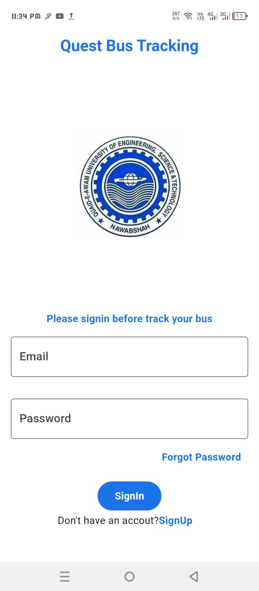
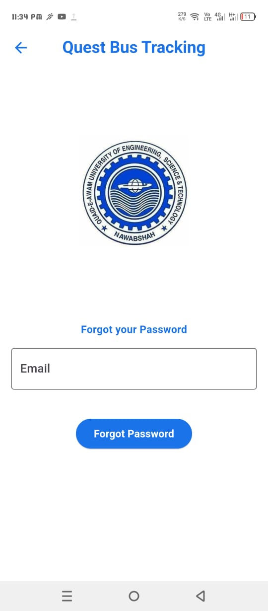
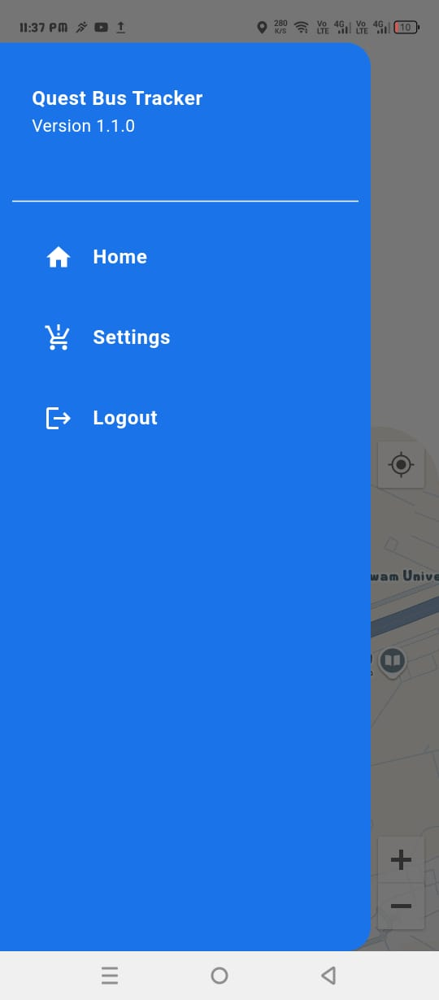
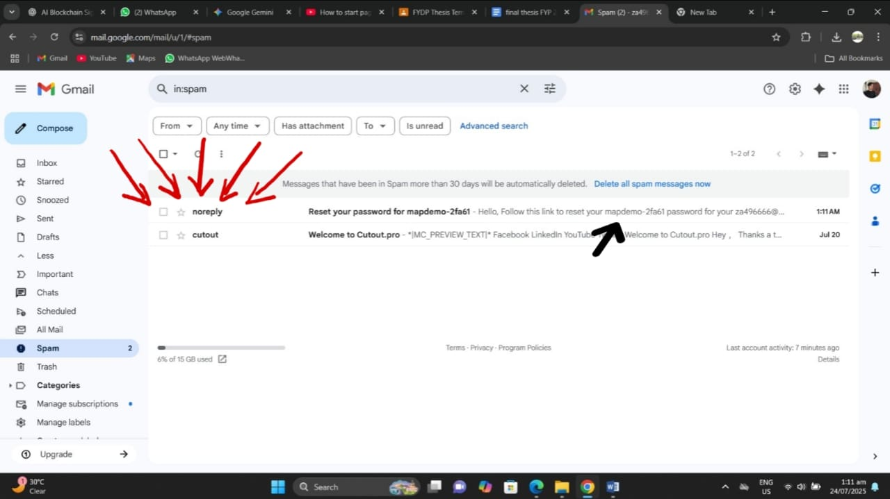
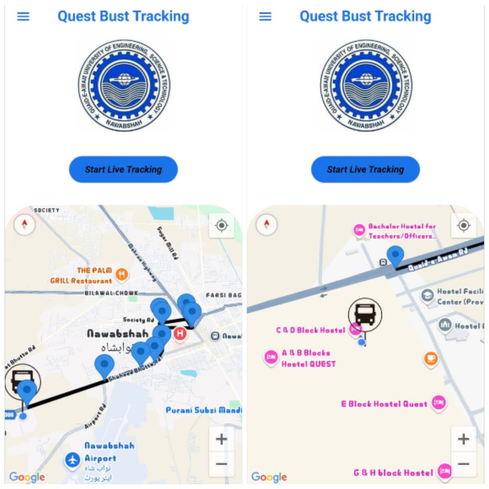
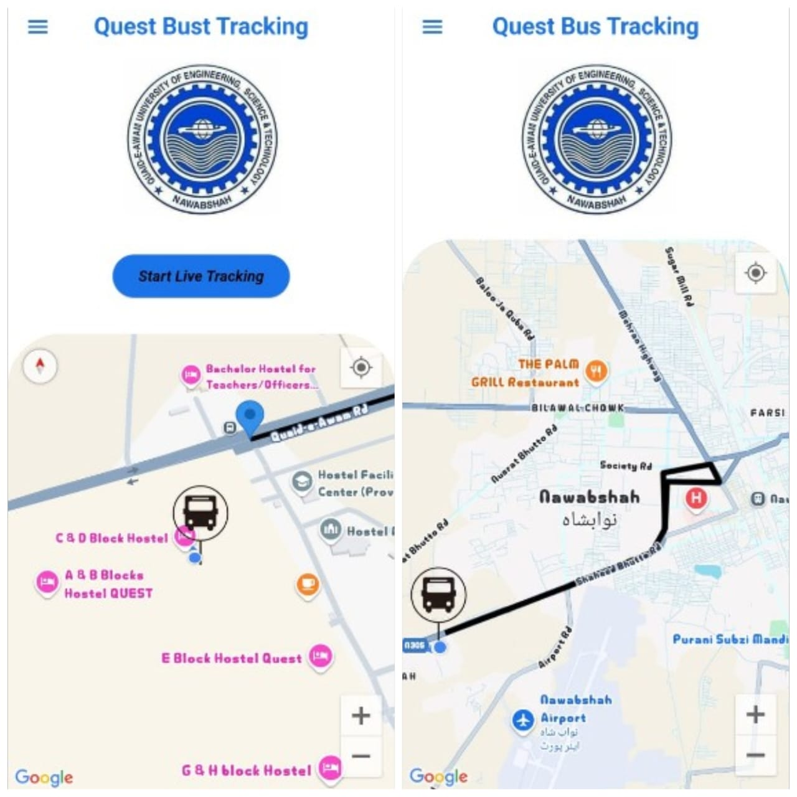

# 🚗 **Real-Time QUEST Bus Tracking App**

**Quaid-e-Awam University of Engineering, Science & Technology Nawabshah.**
**Department of Computer Systems Engineering – Final Year Project (Batch 21)**

---

## 👥 **Project Members**

* **Zubair Ahmed** – Project Leader (21cse31)
* **Muhammed Saad** – Team Member (21cse32)

---

## 🧾 **Project Overview**

**Quest Bus Tracking App** is a real-time vehicle tracking application developed as our **Final Year Project**, aimed at providing accurate and efficient location monitoring for **university buses**.

Built using **Flutter** for the frontend and **Firebase** for the backend, the system ensures seamless location sharing between drivers and students.

The application is designed with a focus on **usability, reliability, and performance**, making real-time tracking simple and accessible.

The system consists of two main panels:

* **👤 User Panel** – Allows students to select and track specific vehicles or drivers in real time.
* **👨‍✈️ Driver Panel** – Enables drivers to share their live location with the system.

---

## 🎯 **Features**

* 🔒 **Secure Authentication** – Separate login system for drivers and users.
* 📍 **Real-Time GPS Tracking** – Accurate location updates using the `geolocator` package.
* 📡 **Firebase Realtime Database** – Instant location syncing between driver and user devices.
* 🔄 **Driver Selection** – Users can choose a specific driver to track.
* 🗺️ **Google Maps Integration** – Location visualization with dynamic markers.
* 📲 **User-Friendly Interface** – Clean and simple design for easy navigation.

---

## 🛠️ **Tech Stack**

* **Frontend:** Flutter (Dart)
* **Backend:** Firebase Realtime Database, Firebase Authentication
* **APIs & Packages:** Google Maps API, Geolocator, Firebase Core

---

## 📌 **How It Works**

1. **Driver logs in** through the driver panel and activates live location sharing.
2. **GPS location** is captured from the driver’s device and sent to Firebase in real time.
3. **User logs in** through the user panel and selects a driver from the list.
4. **Live location** is displayed on Google Maps with continuous updates.

---

If you like this project, give it a ⭐ on GitHub and connect with me
- GitHub : https://github.com/ZubairAhmed-56
- LinkedIn : https://www.linkedin.com/in/zubairahmed56/

📌 Note:
This repository only contains compiled build files from the project.
The original source code is private and not shared publicly.
For Code, contact the author.

📷 Screenshots

  
  
  
  
  
  
  
  
